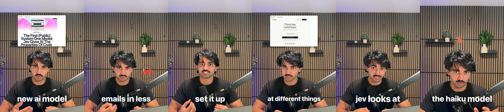

# AI Video Editor

Edit your own talking-head video in the style of a creator you like. Open the folder in Claude Code
and say **edit my video**, or paste a link.

1. Give it your video. It cuts out the retakes, false starts and pauses.
2. Give it a creator. It measures how they edit: cut speed, zooms, captions, graphics, transitions.
3. It renders your video in that style, on your laptop or in the cloud, after you approve each step.

It also makes three other things:

- **Shorts from a long video or podcast.** Paste the link; it finds the clips and edits each one.
- **A product video from a website.** Paste the URL; it asks what to show, records the real product
  and cuts a launch film with its own music.
- **A creator teardown.** Paste a profile; you get what makes their videos work and a style you can
  edit with.



<!-- TODO(owner): drop a 10-second before/after demo GIF at docs/demo.gif, then replace this comment with:  -->

Built by [NextWork](https://nextwork.ai). Free and open source (MIT). Works on Mac, Windows and Linux.

## Start here

You need [Claude Code](https://claude.com/claude-code) and a Claude account (a paid plan or an API
key). Pick one of three ways.

### Way 1: open this folder in Claude Code (easiest)

**1. Install Claude Code** (skip if you have it). Open a terminal:

- **Mac:** press Cmd + Space, type `Terminal`, press Enter. Paste this and press Enter:
  ```
  curl -fsSL https://claude.ai/install.sh | bash
  ```
- **Windows:** press the Windows key, type `PowerShell`, press Enter. Paste this and press Enter:
  ```
  irm https://claude.ai/install.ps1 | iex
  ```
- **Linux:** open your terminal app and paste the Mac line.

**2. Get this folder.** Either:

- **No git:** at the top of this page click the green **Code** button, then **Download ZIP**. Unzip
  it (double-click on Mac, right-click > **Extract All** on Windows). You get a folder called
  `ai-video-editor-main`.
- **With git:** `git clone https://github.com/nextwork-projects/ai-video-editor.git`

**3. Open Claude Code in that folder.** In the terminal type `cd ` (with a space after it), drag the
folder onto the terminal window, press Enter. Then type `claude` and press Enter. The first time,
it asks you to log in.

**4. Say yes when it asks whether you trust this folder.** That lets the editor load. Then type
**edit my video**.

The folder's `.claude/settings.json` turns the editor on. If Claude says the editor is not loaded,
it offers to install it: say yes, then type `/reload-plugins`.

### Way 2: install the plugin, then use any folder

Inside Claude Code, type these two lines (same on every computer):

```
/plugin marketplace add nextwork-projects/ai-video-editor
/plugin install ai-editor@nextwork
```

If it asks, type `/reload-plugins`. Then say **edit my video**. `creator-teardown` installs with it.
Your edits land in whatever folder you started Claude Code in.

### Way 3: other agents (Codex, Cursor, Gemini CLI, Copilot)

In a terminal, on a computer with [Node.js](https://nodejs.org):

```
npx skills add nextwork-projects/ai-video-editor
```

`AGENTS.md` (and its copy `GEMINI.md`) tells the agent where to start. The skills share code in
`plugins/ai-editor/lib/` and the renderer in `plugins/ai-editor/remotion/`, so if your agent copies
single skill folders, clone the whole repo too.

## What happens next

1. **Setup**, first time only. Claude checks your computer and installs what is missing: Python,
   ffmpeg, Node, the free transcription model and the renderer (about 1.5 GB, most of it the
   renderer). On GitHub's clean runners the install took 25-36 s on Linux, 33-49 s on a Mac and
   66-75 s on Windows, with the 75 MB test model in place of the 500 MB default; a home line is
   slower. It asks before each step. Anything that needs your password, Claude gives you
   to paste into your own terminal.
2. **Keys**, optional, about 5 minutes. Three free or near-free accounts that make each edit use
   less of your Claude usage. Skip them and add them later by saying **finish setup**. Never paste
   a key into the chat: Claude gives you a command that saves it from your own terminal.
3. **A few questions, once.** Platform, creators you like, brand, names to show, captions, sound.
   Each is multiple choice and the first option is fine to accept. Saved in
   `~/.ai-video-editor/profile.json`.
4. **Your first edit.** Give the path to your video (an mp4 or mov of you talking to camera), or
   paste a link to it. No video yet? Pick **Use the sample take**.
5. **Approve the cut.** You watch it on a review page and leave notes at any moment; the transcript
   with the removed parts struck through is one click away. Approve it, or send notes.
6. **Approve the stills.** A sheet of frames from the styled edit. Approve, or say what to change.
   You can also open the edit in your browser and move, trim, swap or delete anything by hand.
7. **Pick where to render.** Claude times each option on your video and shows the cost first.
   The render opens on a review page: watch it, pause and leave notes at the moments to change,
   then send them for the next round or approve.
8. **Say what you'd change** ("captions too small", "fewer zooms"). It is saved to
   `~/.ai-video-editor/taste.md` and used on every video after.

Your files land in the folder you started in: `edits/<name>/`, `clips/<name>/`, `product/<name>/`
and `creator-teardowns/<handle>/`.

## What you can say

| Skill | Say | You can paste |
|---|---|---|
| `start` | "edit my video", "make my video look like @creator", "new video" | a video file path; a Google Drive, Dropbox or OneDrive share link; a YouTube or TikTok link; a creator profile |
| `setup` | "set up the editor", "finish setup", "add my Gemini key", "set up Modal" | |
| `creator-teardown` | "break down @creator", "tear down @creator" | a TikTok, YouTube or Instagram profile, or single video links |
| `cut` | "cut my video", "remove my mistakes" | a video file path |
| `style-edit` | "style it", "add captions and zooms", "render the edit", "export to Final Cut" (or Premiere, Resolve, CapCut) | |
| `taste` | "captions too small", "fewer zooms" | |
| `clips` | "clip this video", "make shorts from my podcast" | a long video, a YouTube link, a podcast episode (Apple Podcasts, RSS, YouTube) |
| `product-video` | "make a launch video for my site" | a website URL |
| `improve` | "improve the editor", "process suggestions" (for people working on this repo) | |

`motion-design` is a reference the other skills read; you do not call it yourself.

A Spotify episode is usually locked: paste the same episode from Apple Podcasts, YouTube or its RSS
feed. An iCloud link opens a web page, not the file: download the video first and give its path.

## What it costs

The editor is free. These are what you may pay for. Numbers marked *estimate* are worked out from
published prices, not measured on a bill.

| Part | Cost | Notes |
|---|---|---|
| Claude | Your Claude plan's usage | Not yet measured per video. The three keys below lower it. |
| TypeSafe key (decides the cut) | Under 1 cent a video | $0.042 per million tokens; a 3-minute video is about 5,000 tokens. Finding clips in a 12-13 minute video measured $0.013-0.016. |
| Gemini key (reads a creator's look) | Free | Google AI Studio's free tier, no card. On the paid tier a 7-video teardown measured about $0.02. |
| ElevenLabs key (keeps every "um") | Free for a few hours a month | Optional. Without it, Whisper transcribes on your computer for free. |
| Render on your laptop | Free | Often the fastest for a short video. The styled 44.9-second cut of the sample take (1,346 frames) rendered in 35-84 s on a laptop also running other work; `edit.py estimate` was within 25% of the render in 3 of 4 tries. Claude prints the numbers for your video before you pick. |
| Render on Modal | $0.03 for the 44.9-second sample cut (2.7 min on 3 machines, at Modal's rates). $0.18-0.19 for the whole 3.4-minute sample take rendered uncut (6,167 frames, measured on the bill). About $0.06 for 60 s and $0.54 for 10 min (*estimate*). | The Starter plan includes $30 of free credit a month. The uncut 3.4-minute take took 3.1 min on Modal (4.3 min when the laptop was overloaded during the join) and 6.8 min on a busy laptop. The first render also builds the render machine once (about 2 min). |
| Render on GitHub Actions | Free | Counts against 2,000 free minutes a month on private repos. The 44-second sample cut took about 7 minutes. |
| Render on AWS Lambda | A few cents to a few dollars (*estimate*) | Your own AWS account, card needed. Not measured yet. Claude quotes each render first. |

### Cloud renders

- **Modal** (modal.com): your video is split into pieces that render at once on rented machines,
  then joined on your laptop. Say **set up Modal**; Claude walks you through the free account and
  logs this computer in.
- **GitHub Actions**: free, no card. Claude packs the renderer and your footage into a **private**
  repo in your account (it asks first), renders on up to 20 machines and downloads the result. Say
  **set up GitHub rendering**.
- **AWS Lambda**: many machines at once on your own AWS account. One-time setup of about 20 minutes.
  Say **set up Lambda rendering**.

## Your data

- Everything runs on your computer unless you pick a cloud render. After a cloud render your footage
  is deleted from the service, unless you said to keep it.
- A product video of a logged-in site uses its own browser profile, never your main one. You log in
  by hand, and Claude asks to delete the login when the video is done.
- Names, emails and account details on screen are blurred by default, your own included.
- It never clicks anything that creates, deletes, pays, publishes or invites unless you said yes
  for that video.
- A suggestion you share to help everyone has your names, handles and web addresses removed first.

## Troubleshooting

| Problem | What to do |
|---|---|
| Something is missing or broken | Say **run the editor doctor**. Every line reads `ok`, or `FIX` with the exact command for your computer. |
| Doctor says something moved off the pinned versions | Say **repair the editor setup**. Claude runs `setup.py repair` from wherever the plugin is installed, and it puts the exact pinned set back. From a cloned folder (Way 1) you can run it yourself: `python3 plugins/ai-editor/skills/setup/scripts/setup.py repair` (`py` instead of `python3` on Windows). |
| You skipped a key or step | Say **finish setup**. Only the skipped steps run. |
| Claude does not know "edit my video" | The editor is not loaded. Type `/reload-plugins`, or install it with Way 2. |
| `python3` not found | Mac: `brew install python`. Windows: `winget install -e --id Python.Python.3.12`, then open a new terminal. Linux: `sudo apt install -y python3 python3-venv`. |
| Node is too old on Debian or Ubuntu | Doctor prints the fix: it adds NodeSource's signed package source, then installs Node. |
| Chrome or Chromium installed as a Flatpak | Only logged-in product videos need your Chrome, and a Flatpak one cannot be used. Install Google Chrome or your distro's `chromium` package; doctor says which it found. |
| A tool installed on Windows is still "not found" | Close and reopen Claude Code: a `winget` install only shows up in a new terminal. |
| `yt-dlp returned nothing` | The site changed. Doctor shows how to update yt-dlp, or paste single video links. |
| An Instagram profile fails | Instagram has no free way to list a profile. Paste 10 or more reel links. |
| `Gemini rejected the key` | Make a new key at the link it prints. The teardown carries on without it meanwhile. |
| A Drive or Dropbox link fails | Share it as **Anyone with the link**, and link the video file, not the folder. |
| `the Modal render failed` | Claude offers the laptop render instead. |
| You logged into a site for a product video and want that login gone | Say **log me out of <site>**. Claude runs `login.mjs logout <site>`. From a cloned folder (Way 1): `node plugins/ai-editor/skills/product-video/scripts/login.mjs logout <site>`. |
| Where are my keys? | `~/.config/creator-teardown/.env`, shared by both plugins. With `AI_EDITOR_HOME` set, `$AI_EDITOR_HOME/.env` instead, and the shared file is never read. |

Without Claude, from a cloned folder (Way 1), one command does the whole install and is safe to re-run:

```
python3 plugins/ai-editor/skills/setup/scripts/setup.py bootstrap
```

Every install gets the same versions: Python packages from a hashed lock file
(`plugins/ai-editor/requirements/requirements.lock`), Node packages from `package-lock.json`, and
each model checked against its sha256.

## License

This repo is MIT. See [LICENSE](LICENSE) and [NOTICE](NOTICE).

The tools it runs have their own licences:

| Tool | Licence | What it means for you |
|---|---|---|
| [Remotion](https://www.remotion.dev/license) (the renderer) | Remotion License | Free for individuals and for companies of up to 3 people. Bigger companies need a Remotion company licence. |
| [GSAP](https://gsap.com/community/standard-license/) (animation in the renderer, and the `gsap-skills` plugin) | GSAP Standard License | Free, commercial use included, every plugin too. Not an OSI open-source licence. It bans using GSAP in a no-code visual animation builder that competes with Webflow's. |
| [HyperFrames](https://github.com/heygen-com/hyperframes) (the `hyperframes` plugin, and code ported from it) | Apache-2.0 | Free. Ported code keeps HeyGen's copyright, listed in [NOTICE](NOTICE). |

Assets fetched while editing: brand logos from [Simple Icons](https://simpleicons.org) (CC0), icons
from [Lucide](https://lucide.dev) ([ISC licence](https://lucide.dev/license)).

## Contributing

- The rules every video follows, for every user:
  [plugins/ai-editor/PRINCIPLES.md](plugins/ai-editor/PRINCIPLES.md).
- Open this folder in Claude Code and say **improve the editor**: the `improve` skill turns the
  corrections users marked "would help everyone" into rules, checks and tests here.
- What is next: [docs/BACKLOG.md](docs/BACKLOG.md). What changed: [CHANGELOG.md](CHANGELOG.md).
- In this folder the editor loads from your working copy. To turn it off while you work, set
  `"ai-editor@nextwork": false` under `enabledPlugins` in `.claude/settings.local.json`.
- Run the checks before a pull request:
  ```
  python3 tests/check_plugins.py
  claude plugin validate --strict .
  python3 tests/smoke.py
  ```
  plus each script's `demo` (the list is in `.github/workflows/check.yml`). The model evals cost
  money; `tests/run_evals.sh --runs 1 --case <case>` runs one.
